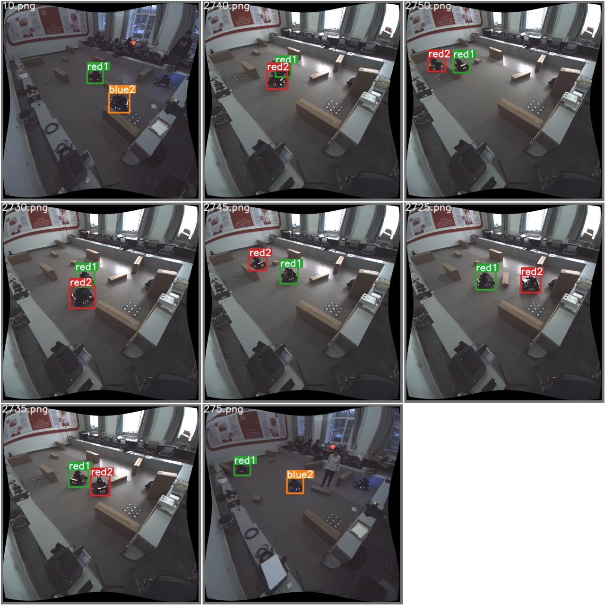
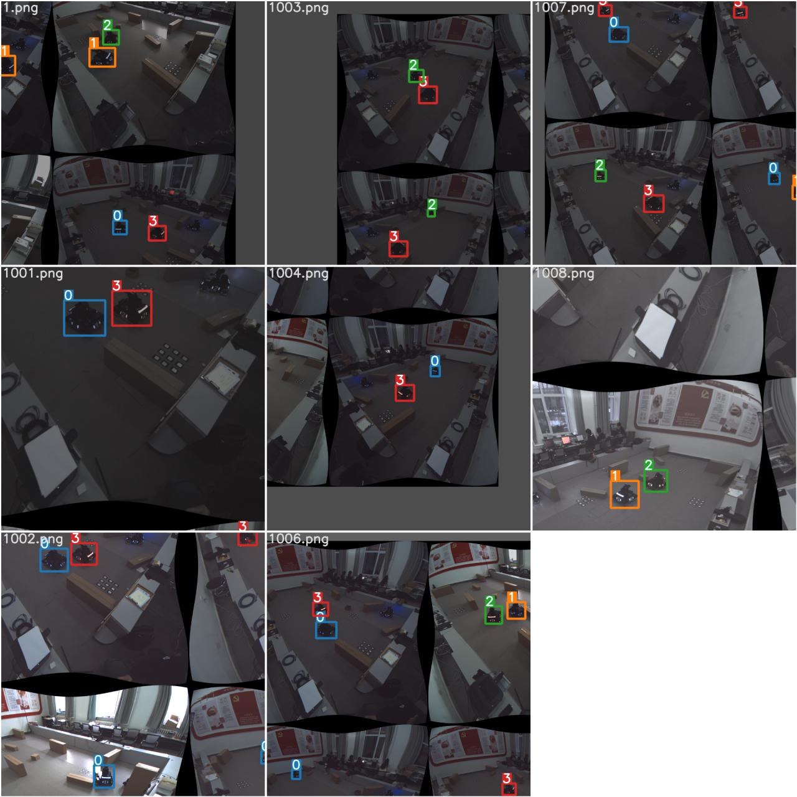
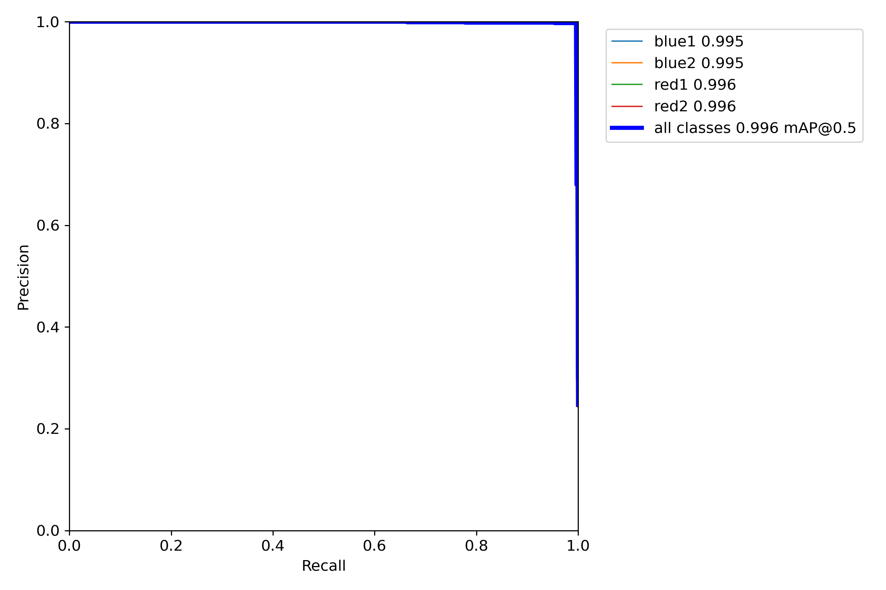
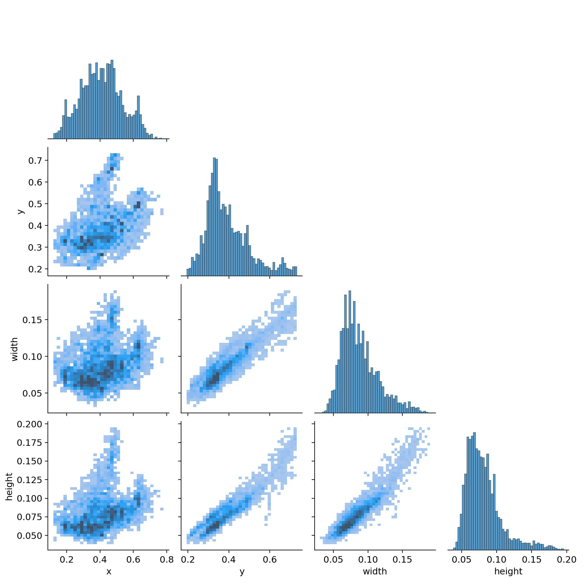
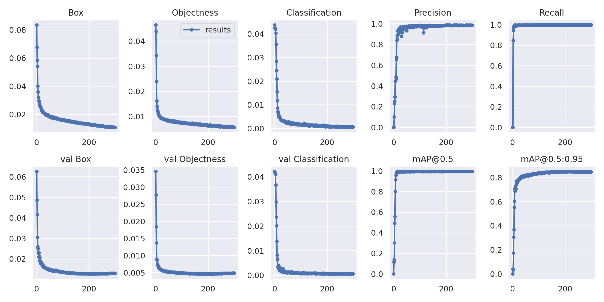
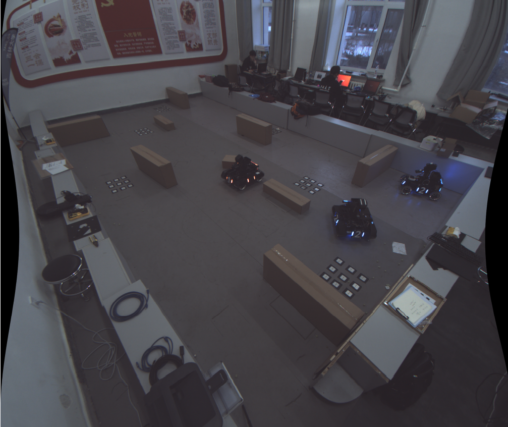
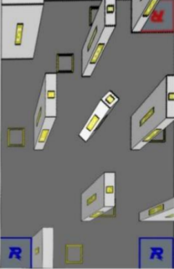
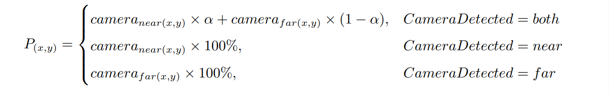
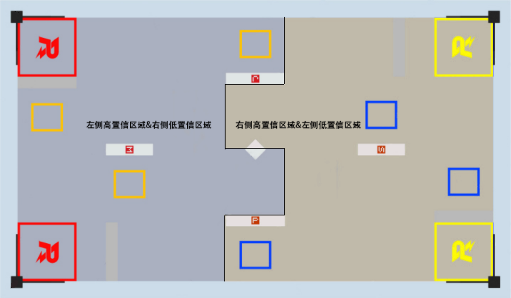
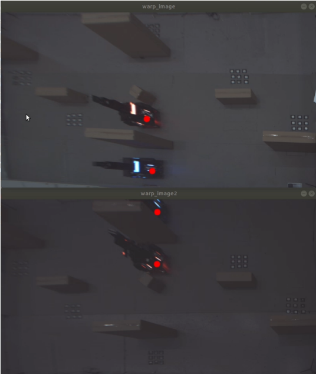

# JLU RMUA Sentry

### 介绍

本项目用于 吉林大学TARS_GO战队ICRA人工智能挑战赛 哨岗目标检测与识别

### 功能性模块说明
哨岗全局观测的主要任务是将场上所有机器人的位置和身份信息进行采集并与我方机器人其他模块共享。我们采用 yolo 算法对机器人的红蓝方身份与在场地内的实际信息进行识别并进行处理，在每一个处理帧结束后通过 UDP 对所有我方机器人广播。

#### 1.深度学习框架
- 哨岗感知系统使用了基于 CUDA 框架下 TensorRT 加速的深度学习 yolov5n 推理模型，相较于识别精度较高的 yolov5x 模型和识别效率较高的 yolov5s，yolov5n 具有稳定性和鲁棒性高的优势。

图1.1 Yolov5n 模型识别效果

图1.2 全局识别效果

图1.3 Precison-Recall曲线

图1.4 

图1.5

#### 2.图像预处理与地图标注
- 哨岗所放置的位置与场地之间相对固定且距离过近，寻常的标准镜头相机无法捕捉到整个场地的信息，我们选择了广角镜头相机采集图像，并通过畸变校正算法将被扭曲的图像进行还原。

图2.1 图像还原
- 鉴于需要进行识别的场地相对哨岗相机的位置是固定不变的，对已校正畸变的场地图像的四个角点在准备时间手动标注，并通过透视变换的方法将选中的图像区域变换为8080mm*4480mm 的标准场地，这样方便直接获取识别所得目标在平面坐标系场地下的坐标。
- 在原图像中，选用目标识别算法输出的矩形框几何中心向图像 x 轴正方向偏移 1/4 个矩形框 x 轴长度的像素点作为理想的机器人底盘中心点。由于经透视变换后所分割的图像与场地一致，因此所得机器人地盘中心点可直接作为坐标输出。

图2.2 透视变换后地图

- 由于透视变换后距离单个相机较远区域的图像畸变大，以及单侧方向相机视线会被场地内障碍物遮挡，导致丢失场地图像信息，我们采用对角双相机，将每个相机识别位置较为准确的近侧半场作为高置信度区域，畸变严重的远侧半场作为低置信度区域，对同一目标在不同相机当中的信息进行融合，计算公式为：(其中 $\alpha$ 为置信程度)。

图2.3 计算置信度

图2.4 置信区域

图2.5 对角双相机视角

#### 3.识别追踪与通信
- 基于已知场地数据构建相机位姿与场地平面的联合模型，解算由 yolov5n 模型推理得到的目标信息，再结合场地坐标计算获得目标机器人的位姿坐标。
- 在训练过程当中，我们预设了4个标签：蓝色一号，蓝色二号，红色一号，红色二号。同时我们训练了两份模型：将所有类型的机器人的死亡状态分别标注为蓝色或红色。在实际比赛的过程当中，我们将选择使用敌方机器人在潜伏状态前的颜色作为死亡状态划分的模型，由于我方定位坐标已知，如果我方机器人死亡，将哨岗识别所获得的敌方坐标（包含死亡机器人）中匹配我方机器人坐标的全部刨除，所剩就是敌方机器人坐标；如果敌方机器人死亡，我们将从裁判系统获知的死亡机器人编号的坐标刨除。这种方案使得 yolo 模型对于场上非 4 种标签的机器人有良好的规避作用，减少了误识别的情况。

### 注意事项

#### A.依赖环境
1. Ubuntu18.04 Kernel5.4
2. NVIDIA driver 470
3. CUDA 11.1
4. cuDNN 8.1.1
5. TensorRT 7.2.3.4
6. Anaconda3 5.20
7. yolov5 v4.0
8. tensorrtx-yolov5-v4.0
9. opencv 3.4.3
10. flycapture2 2.3.13(not strongly required) 

#### B.编译环境
要求Cmake环境

#### C.文件目录
├── CMakeLists.txt                    
├── FlyCamera.h                        
├── FlyCamera.cpp                      
├── car_classification.hpp                    
├── gen_wts.py                    
└── yolov5_sentry.cpp

#### D.原理介绍
>> 原理介绍如功能性模块说明所示

#### F.未来优化方向
- 融合三维重建与深度学习，通过对角线两张不同角度的图片识别机器人的三维模型，获取其实时姿态
- 复现6D算法，识别机器人实时的重心作为其坐标，修正因俯视广角拍摄带来的坐标误差

### 使用说明
1.  使用tensorrtx需要严格对应yolov5版本
2.  cd到build文件夹（或其他新建文件夹），根据你的需求运行以下命令：
- `./yolov5 -s [xxx.wts] [xxx.engine] s/x/n/l`  
转译wts文件生成engine文件
- `./yolov5 -d [xxx.engine]`
运行程序
3.  运行程序后，按照左-下-上-右的顺序点击地图地面的四个角，再点击一次图片，随后按Q键完成地图标定
